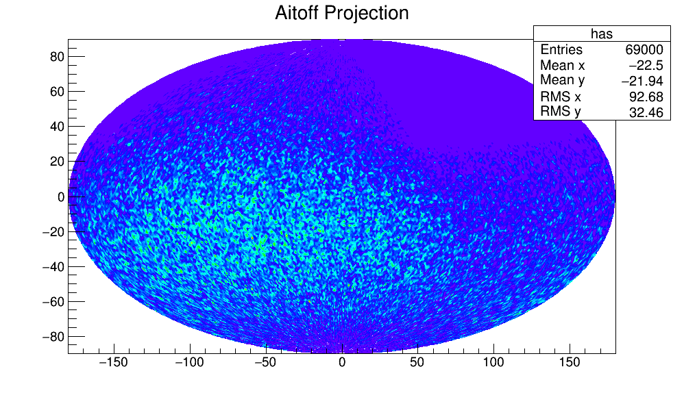

The ROOT framework is used to analyze the angular correlation of cosmic rays, the distribution of angual distance is calculated

then the significance of the difference from the ideal isotropic data and the real data is calculated

and lastly is showed the distribution of the cosmic rays

